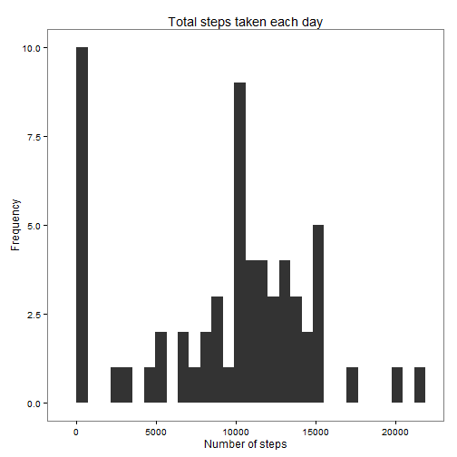
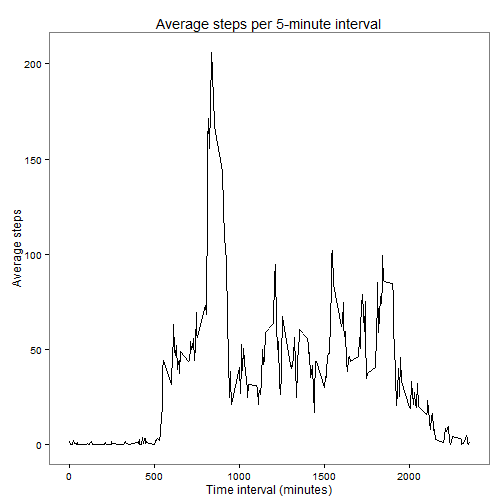
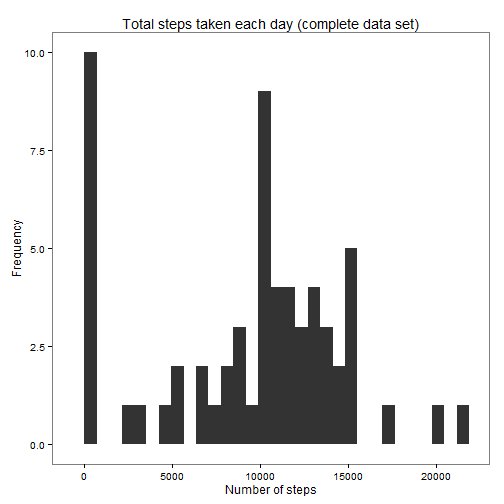
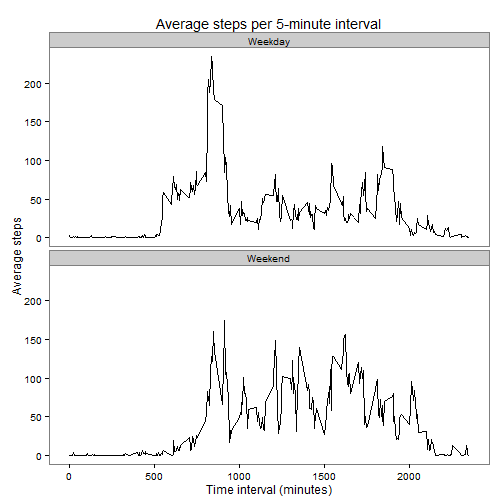

Data on personal movement using activity monitoring devices.  
Original repository: https://github.com/rdpeng/RepData_PeerAssessment1 (forked 2015-11-15)  
Author: ML Muller  
Date: 2015-11-15

### Loading and preprocessing the data

```r
#-------------------------------------------------------------------------------#
# Load the data
activity <- read.csv(unz("activity.zip", "activity.csv"), stringsAsFactors = FALSE)

#-------------------------------------------------------------------------------#
# Load packages
library(dplyr)
library(lubridate)
library(ggplot2)

#-------------------------------------------------------------------------------#
# Preprocess the data
# Convert to table-data frame
activity <- tbl_df(activity)

# Convert date variable to class date
activity$date <- ymd(activity$date)
```

### Number of steps taken per day

```r
#-------------------------------------------------------------------------------#
# Calculate total number of steps per day
steps_date <- activity %>%
    group_by(date) %>%
    summarise(total = sum(steps, na.rm = TRUE))

# Histogram of the total number of steps per day
ggplot(steps_date, aes(total)) +
           geom_histogram() +
    xlab("Number of steps") +
    ylab("Frequency") +
    ggtitle("Total steps taken each day") +
    theme_bw() +
    theme(panel.grid=element_blank())
```

 

```r
# Mean number of steps per day
mean(steps_date$total, na.rm = TRUE)
```

```
## [1] 9354.23
```

```r
# Median number of steps per day
median(steps_date$total, na.rm = TRUE)
```

```
## [1] 10395
```

### Average daily activity pattern

```r
#-------------------------------------------------------------------------------#
# Time-series plot of the 5-minute interval (x-axis) and the average number of
# steps taken, averaged across all days 

# Calculate average number of steps per day
steps_interval <- activity %>%
    group_by(interval) %>%
    summarise(mean = mean(steps, na.rm = TRUE))

# Plot
ggplot(steps_interval, aes(interval, mean)) + 
    geom_line() +
    xlab("Time interval (minutes)") +
    ylab("Average steps") +
    ggtitle("Average steps per 5-minute interval") +
    theme_bw() +
    theme(panel.grid=element_blank())
```

 

```r
# Five-minute interval with the maximum number of steps
steps_interval$interval[steps_interval$mean == max(steps_interval$mean)]
```

```
## [1] 835
```

### Imputing missing values

```r
#-------------------------------------------------------------------------------#
# Calculate the total number of missing values in the dataset 
# (i.e. number of rows with NA)
length(activity[complete.cases(activity) == FALSE])
```

```
## [1] 2304
```

```r
# Fill in all of the missing values in the dataset using
# the mean for that 5-minute interval
# Create a new dataset with the missing data filled in
# (note the only variable that has missing values is the "steps" variable)

activity_complete <- left_join(activity, steps_interval, by = "interval")

with(activity_complete[is.na(activity_complete$steps)],
     steps <- mean)

# Calculate total number of steps per day
steps_date_complete <- activity_complete %>%
    group_by(date) %>%
    summarise(total = sum(steps, na.rm = TRUE))

# Histogram of the total number of steps per day
ggplot(steps_date_complete, aes(total)) +
           geom_histogram() +
    xlab("Number of steps") +
    ylab("Frequency") +
    ggtitle("Total steps taken each day (complete data set)") +
    theme_bw() +
    theme(panel.grid=element_blank())
```

 

```r
# Mean number of steps per day
mean(steps_date_complete$total, na.rm = TRUE)
```

```
## [1] 9354.23
```

```r
# Median number of steps per day
median(steps_date_complete$total, na.rm = TRUE)
```

```
## [1] 10395
```

* Do these values differ from the estimates from the first part of the assignment?  No, because the mean values were used to replace missing values.

* What is the impact of imputing missing data on the estimates of the total daily number of steps?  None

### Differences in activity patterns between weekdays and weekends

```r
#-------------------------------------------------------------------------------#
# Set "North America" as locality to display weekdays in English
# (necessary only for localities whose default languate is not English)
Sys.setlocale("LC_TIME", "C")
```

```
## [1] "C"
```

```r
# Create new factor variable with two levels "weekday" and "weekend"
activity_complete$day <- weekdays(activity_complete$date)

activity_complete$day <- ifelse(activity_complete$day == "Saturday" | 
                                    activity_complete$day == "Sunday",
                                "Weekend", "Weekday")

# Panel plot containing a time series plot of the 5-minute interval (x-axis) 
# and the average number of steps taken, averaged across all weekday days or 
# weekend days (y-axis). 

# Calculate average number of steps per day
steps_interval_complete <- activity_complete %>%
    group_by(interval, day) %>%
    summarise(mean = mean(steps, na.rm = TRUE))

# Plot
ggplot(steps_interval_complete, aes(interval, mean)) + 
    geom_line() +
    facet_wrap(~ day, ncol = 1) +
    xlab("Time interval (minutes)") +
    ylab("Average steps") +
    ggtitle("Average steps per 5-minute interval") +
    theme_bw() +
    theme(panel.grid=element_blank())
```

 

* Are there differences in activity patterns between weekdays and weekends?  Activity takes longer during the weekends

### Generate html file

```r
#-------------------------------------------------------------------------------#
# This code is not evaluated, but was used to generate the html file
# library(knitr)
# knit2html("PA1_template.Rmd", "PA1_template.html")
#-------------------------------------------------------------------------------#
```

